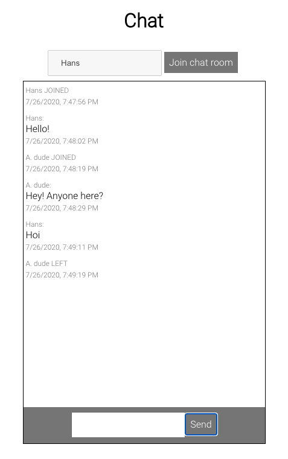

# ws-simple-chat

Simple chat app based on Web Sockets.



The backend is a simple Node server, with an additional small module to handle user sessions.
Server gets client requests and broadcasts messages to every connected user, including users joining/leaving the chat room notifications.

The client is a simple React app, with an additional small module to handle web socket connection.

I used socket.io library for web sockets handling, as it provides broadcast and reconnections support out of the box.

## How to run it

Run in the root directory:
```
docker-compose up
```
Then visit `http://localhost:3000/`.

## TODOs

- Add database support
- Client side: improve user experience (make buttons more visible, add ENTER key pressed handling on inputs)
- Server side: improve logging on the server side
- Server side: handle websockets reconnections so that they are transparent to the user
